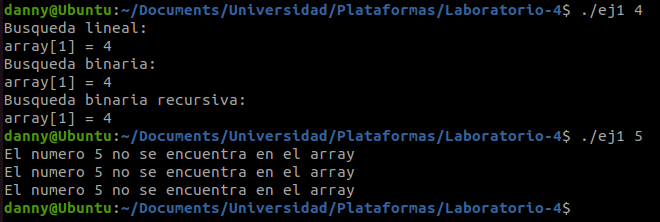
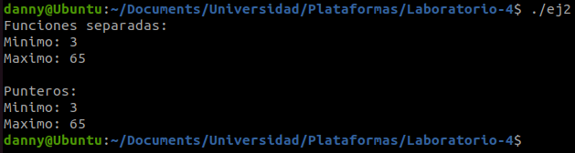

### Universidad de Costa Rica
#### IE0117 Programación Bajo Plataformas Abiertas
#### B93070 Daniela Fonseca Zumbado
---
# Laboratorio-4

## Introducción
A través de este laboratorio, se aborda tres aspectos importantes en el desarrollo de software, para el programa de C. Estos aspectos son el uso de arreglos, de recursividad y de punteros. Los arreglos son un tipo de dato que brinda ciertas facilidades a la hora de elaboración y ejecución de un programa, ya que permiten contener varios datos dentro de sí.

## Implementación
### Arreglos y recursividad
Este programa recibe un parámetro ingresado por el usuario, el cual debe corresponder a un número entero. El objetivo de este programa es tomar este número entero y compararlo con los números que se encuentran dentro de un arreglo ordenado, el cual se detalla a continuación.

$$array = (2, 4, 6, 23, 56, 79)$$

Se detalla la implementación de las funciones del programa:

_**Búsqueda Lineal**_

Recibe como parámetros el número ingresado por el usuario, el arreglo ordenado mencionado anteriormente, y el tamaño del arreglo, que se calcula en la función principal. Itera sobre los valores del arreglo en orden secuencial, y retorna la posición del número dentro del arreglo que coincide con el número ingresado por el usuario, en caso de que lo haya.

_**Búsqueda Binaria**_

Recibe como parámetros el número ingresado por el usuario y el arreglo ordenado, pero también un número $f$. Este número f coincide debe coincidir con el tamaño del arreglo, ya que corresponde a la posición del último número dentro del arreglo. No se solicita un parámetro de la primera función del arreglo ya que se asume que es cero, y la función no es recursiva.

Esta función utiliza un loop de _while_. Se calcula el valor medio entre la posición inicial $0$ y la posición final $f$. Se compara el número ingresado por el usuario, con el valor del arreglo que se encuentra en la posición media $h$ [[1]](https://github.com/dfonsecz/Laboratorio-4?tab=readme-ov-file#referencias).

1. Si se determina que $h$ es mayor, en el siguiente ciclo de _while_, la posición inicial pasa a ser $h-1$.
2. Si se determina que $h$ es menor, en el siguiente ciclo de _while_, la posición final pasa a ser $h+1$.

_**Búsqueda Binaria Recursiva**_

Recibe como parámetros el número ingresado por el usuario, el arreglo ordenado, un número inicial $i$, y un número inicial $f$. Al inicializar esta función por primera vez, se ingresan los parámetros $i = 0$ y $f = size$ (tamaño del arreglo). Sin embargo, debido a que esta función debe operar de manera recursiva, estos dos parámetros cambian conforme se complete cada ciclo de operación de la función.

La funcionalidad es similar a la de la función anterior. Se calcula un valor medio, y se determina el nuevo rango de la misma manera.

1. Si se determina que $h$ es mayor, en el siguiente ciclo de _while_, la posición inicial pasa a ser $h-1$.
2. Si se determina que $h$ es menor, en el siguiente ciclo de _while_, la posición final pasa a ser $h+1$.

La diferencia es que en vez de cambiar las variables locales, se llama de nuevo a la misma función con los nuevos parámetros.

### Arreglos y punteros
Este programa no recibe argumentos de parte del usuario que lo ejecuta. Simplemente se espera su ejecución. En la función principal se define un arreglo desordenado, el cual se presenta a continuación.

$$array = (21, 24, 65, 3, 56, 12, 35, 15)$$

Este programa se compone por tres funciones, aparte de la principal. A continuación se detalla el funcionamiento de estas:

_**Encontrar mínimo**_

Recibe como parámetros un arreglo y el tamaño de este arreglo. Inicialmente se define que el mínimo es el número que se encuentra en la posición $0$ del arreglo. Este mínimo se almacena en una variable. Posteriormente, se utiliza un ciclo _for_ para iterar por el resto de los valores del arreglo y determinar si alguno es menor que el valor mínimo guardado dentro de la variable. Si lo es, se guarda el nuevo valor mínimo temporal. Cuando termine el ciclo for, el número mínimo absoluto del arreglo será el que está guardado dentro de la variable. Se retorna la posición de este número en el arreglo.

_**Encontrar máximo**_

Recibe como parámetros un arreglo y el tamaño de este arreglo. Inicialmente se define que el máximo es el número que se encuentra en la posición $0$ del arreglo. Este máximo se almacena en una variable. Posteriormente, se utiliza un ciclo _for_ para iterar por el resto de los valores del arreglo y determinar si alguno es menor que el valor máximo guardado dentro de la variable. Si lo es, se guarda el nuevo valor máximo temporal. Cuando termine el ciclo for, el número máximo absoluto del arreglo será el que está guardado dentro de la variable. Se retorna la posición de este número en el arreglo.

_**Encontrar mínimo y máximo con punteros**_

Esta función recibe como parámetros el puntero del arreglo, del mínimo y del máximo, y también el tamaño del arreglo. La función itera sobre los elementos del arreglo usando _for_ loop. Inicia desde el segundo elemento (ya que el mínimo y máximo están inicialmente definidos como el primer elemento) hasta el último elemento del arreglo. En el bucle, se compara cada elemento con el valor mínimo y máximo actuales guardados en variables. Si se encuentra un elemento menor que el valor mínimo actual, se actualiza el valor mínimo. Si se encuentra un elemento mayor que el valor máximo actual, se actualiza el valor máximo. Al finalizar el loop, se cuenta con los valores máximo y mínimo.

## Resultados

### Arreglos y recursividad

Al ejecutar el programa e ingresar como argumento el número $4$, el cual se sabe de antemano que se encuentra dentro del arreglo, se obtiene el mismo resultado con las tres funciones implementadas. Se encuentra la posición dentro del arreglo de este número. Por otra parte, al ingresar como argumento el número $5$, que no se encuentra dentro del arreglo definido, se imprime un mensaje que indica que este número no se encuentra dentro del arreglo. Esto se puede confirmar en la figura que se presenta a continuación.

### Arreglos y punteros

Al ejecutar este programa, en primer lugar se observan los resultados de usar las dos primeras funciones, que calculan el mínimo y el máximo de manera independiente. Después, se observa el resultado de usar la función para encontrar estos valores simultáneamente con punteros. Los resultados obtenidos coinciden a pesar de que la manera de obtenerlos es diferente.

## Conclusiones y recomendaciones
1. La recursividad es una herramienta útil para cuando se requiere iterar datos en una función. Sin embargo, es importante ser cuidadoso con definir cuándo acaba esta iteración, ya que de lo contrario existe el riesgo de que el programa entre en un bucle infinito.
2. Para estos y muchos programas, es importante considerar casos que puedan suceder que hagan que el código no se ejecute correctamente. Durante el desarrollo de este laboratorio fue común obtener errores de segmentación al probar los programas, hasta prevenirlos.

## Referencias
[1] Khan Academy, “Búsqueda Binaria,” Khan Academy, https://es.khanacademy.org/computing/computer-science/algorithms/binary-search/a/binary-search. 
